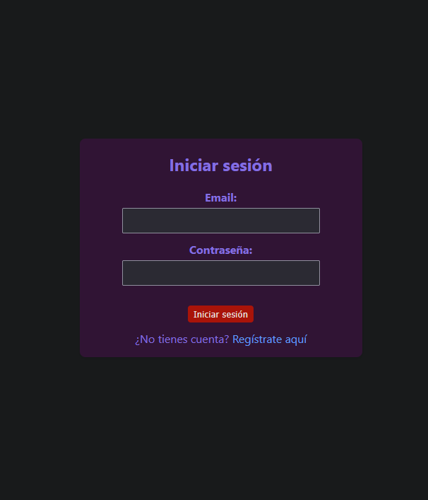

Personal Finance App

A comprehensive personal finance manager: track income and expenses, visualize trends, set budgets, and export your data.

Table of Contents

Features

Demo & Screenshots

Tech Stack

Project Structure

Prerequisites

Installation & Running

Environment Variables

Usage

Testing

Deployment

Contributing

License

Features

🔐 Authentication: Secure JWT-based login and registration

📝 Transaction Management: Create, edit, and delete income and expense entries

📊 Visual Insights: Interactive charts showing spending and income trends

💾 Export Data: Download transactions as CSV or PDF reports

🎯 Budget Control: Category-based budget tracking

🌗 Dark/Light Mode: Respects user’s color scheme preference

📱 Responsive Design: Optimized for mobile, tablet, and desktop

Demo & Screenshots

Tech Stack

Layer

Technology

Frontend

React, Vite, Axios

Styling

CSS

Backend

Node.js, Express

Database

MongoDB, Mongoose

Auth

JWT, bcrypt.js

CI/CD

GitHub Actions

Project Structure

personal-finance-app/
├── backend/          # Node.js & Express API
├── frontend/         # React application
├── database/         # Migrations & seeds
├── docs/             # Documentation & images
├── scripts/          # Dev utilities
└── .github/          # GitHub workflows for CI/CD

Prerequisites

Node.js (v16+)

npm or Yarn

MongoDB (local or Atlas)

Installation & Running

Clone the repository:

git clone https://github.com/JD117parra/personal-finance-app.git
cd personal-finance-app

Install backend dependencies and start server:

cd backend
npm install
npm run dev

In a new terminal, install frontend dependencies and start client:

cd frontend
npm install
npm run dev

Environment Variables

Backend (backend/.env)

PORT=5000
MONGO_URI=mongodb://localhost:27017/finanzas
JWT_SECRET=your_jwt_secret

Frontend (frontend/.env)

VITE_API_URL=http://localhost:5000

Usage

Open your browser at http://localhost:5173 (or the port displayed by Vite).

Register a new account and log in.

Manage your transactions and view financial insights.

Testing

To be implemented: unit and integration tests with Jest or Mocha.

Deployment

Build the production bundle:

cd frontend
npm run build

Configure your hosting of choice (Heroku, Vercel, Netlify, or your VPS) to serve frontend/dist and connect the backend API.

Contributing

Contributions are welcome! Feel free to open issues or submit pull requests to improve features, documentation, or tests.

License

This project is licensed under the MIT License. © 2025 JD117parra

